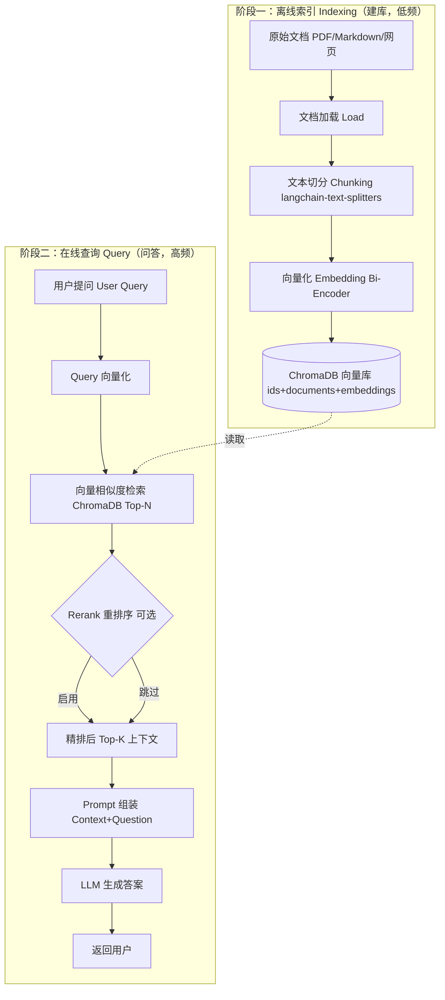
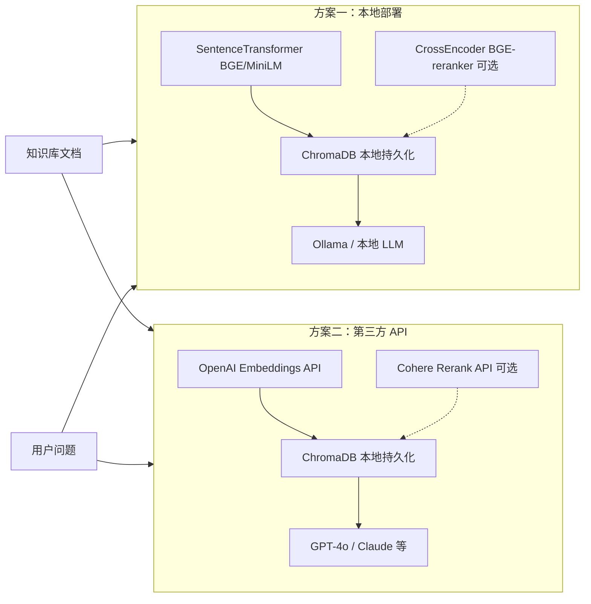
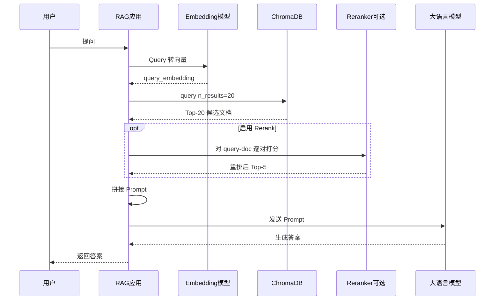

前提：需要使用向量数据库ChromaDB来实现RAG技术的运用，分为本地 ComfyUI 和调用第三方 LLM API 的环境。

要在项目中落地RAG技术，核心就是构建一个“检索-增强生成”的闭环。下面拆解如何在本地环境和使用第三方API这两种主流模式下，用ChromaDB实现这一过程。

## RAG 原理及完整流程示意

> **RAG（Retrieval-Augmented Generation，检索增强生成）** 的核心思想：不让 LLM 凭记忆回答，而是先从知识库检索相关片段，再让 LLM 基于这些片段生成答案。完整流程分为 **离线索引（Indexing）** 与 **在线查询（Query）** 两阶段。

### 整体架构（两阶段）



### 双方案对比流程



### 单次问答时序



### 关键组件说明

| 组件 | 作用 | 本文对应工具 |
|------|------|-------------|
| **Chunking** | 把长文档切成可检索的小块 | `langchain-text-splitters` |
| **Bi-Encoder** | 快速向量化，用于初次召回 | BGE-small / OpenAI Embeddings |
| **Vector DB** | 存储并检索向量 | ChromaDB（本文两种方案均为本地 `PersistentClient`） |
| **Cross-Encoder** | 精准重排，可选 | BGE-reranker / Cohere Rerank |
| **LLM** | 基于上下文生成自然语言答案 | Ollama / GPT-4o |

作为技术决策的参考，对这两种方案的可行性要点总结如下：


| 对比维度        | 本地环境（Python/ComfyUI）                    | 调用第三方LLM API                                  |
| ----------- | --------------------------------------- | --------------------------------------------- |
| **✅ 技术可行性** | 高度可行，技术成熟，文档完善，已成为RAG实践的主流标准。           | 高度可行，所有主流模型提供商均提供功能完备的API，已为开发者广泛采用。          |
| **💰 成本评估** | 前期主要为硬件/服务器成本。长期高频使用成本更低，不受API按次计费模式影响。 | 按量付费，无需硬件投入，但大规模使用时成本会显著增加，精确地说是“成本随使用量线性增长”。 |
| **⚙️ 运维负担** | **中/高**：团队需负责部署、维护、监控、扩展整个系统（含本地 ChromaDB）。 | **低/中**：LLM 与 Embedding 由供应商托管；**ChromaDB 在本文两种方案中均为本地 PersistentClient 部署**，向量库需自行维护。若改用 Pinecone 等托管向量库，运维可进一步降低。 |
| **🔒 数据安全** | **高**：数据在本地闭环处理，满足金融、医疗等对数据私密性有严格要求的场景。 | **低/中**：敏感数据传输和处理依赖于服务商的安全合规能力，需经过严格审查。       |
| **🚀 部署效率** | **低**：需要从零搭建和配置整个环境。                    | **高**：开箱即用，通过API Key即可快速集成，适合敏捷开发和概念验证。       |


### ✍️ 准备工作：技术选型与依赖安装

无论何种方案，都需要一个 Python 环境来运行核心逻辑。
建议为项目创建一个虚拟环境，并安装 `chromadb` 客户端。

- **创建虚拟环境并安装基础库**：在终端中依次执行以下命令，创建一个干净的 Python 环境并安装核心依赖。
  ```bash
  # 创建并进入项目目录
  mkdir my_rag_project && cd my_rag_project
  # 创建Python虚拟环境
  python -m venv venv
  # 激活虚拟环境 (Windows: venv\Scripts\activate, macOS/Linux: source venv/bin/activate)

  # 安装核心依赖库
  pip install chromadb   # 向量数据库
  pip install sentence-transformers  # 本地嵌入模型，用于生成向量
  pip install langchain-text-splitters  # 文本分割工具，用来将大文档切分成小文本块
  ```

完成环境准备后，针对两种模式，具体操作流程如下。

**文档切分（Chunking）示例**：在向量化之前，需将长文档切分为小块：

```python
from langchain_text_splitters import RecursiveCharacterTextSplitter

splitter = RecursiveCharacterTextSplitter(chunk_size=500, chunk_overlap=50)
chunks = splitter.split_text(raw_document)  # raw_document 为完整文档字符串
```

---

#### 🖥️ 方案一：本地部署环境

此方案适用于数据敏感、有长期高频使用或离线运行需求的场景。

**1. 嵌入模型选择**
可以选用轻量化的 BGE-small 或 `all-MiniLM-L6-v2`（生成 384 维向量），或精度更高的 BGE-large（生成 1024 维向量）。**处理中文文档**时推荐 `BAAI/bge-small-zh-v1.5` 或 `shibing624/text2vec-base-chinese`。**索引与查询必须使用同一模型**，且向量维度需与 ChromaDB 集合一致。

> **BGE query instruction**：短 query 检索长文档（s2p 场景）时，可在 query 前加指令前缀以提升召回精度。v1.5 模型不加前缀也可用，但加前缀通常效果更好。文档/passage **不需要**加前缀。

**2. 文档向量化与存储**
将预处理后的文档分割成块并向量化后，存入ChromaDB。

```python
import chromadb
from sentence_transformers import SentenceTransformer

# 1. 初始化ChromaDB持久化客户端，指定存储路径
client = chromadb.PersistentClient(path="./my_chroma_db")

# 2. 创建或获取一个集合（类似数据库中的表）
collection = client.get_or_create_collection(name="my_knowledge_base")

# 3. 加载嵌入模型（中文文档示例）
model = SentenceTransformer('BAAI/bge-small-zh-v1.5')
QUERY_INSTRUCTION = "为这个句子生成表示以用于检索相关文章："

# 示例：一批要存入知识库的文档块
documents = [
    "公司2024年Q3财报显示，营收达到1000万美元。",
    "我们的退款政策规定，未拆封商品可在30天内退货。",
    "最新发布的2.0版本软件增加了对ARM架构的支持。"
]
ids = ["doc1", "doc2", "doc3"]  # 为每个文档设置唯一的ID

# 生成向量
embeddings = model.encode(documents).tolist()

# 存入ChromaDB
collection.add(
    ids=ids,
    documents=documents,
    embeddings=embeddings
)
```

**3. 检索与生成**
用户提问时，ChromaDB先检索出相关文档，然后组合成提示词交给LLM生成答案。

```python
# 1. 用户查询
query = "最新的营收数据是多少？"

# 2. 将查询语句转换为向量（query 可加 instruction 前缀，document 不加）
query_embedding = model.encode([QUERY_INSTRUCTION + query]).tolist()

# 3. 在ChromaDB中进行相似性检索，k=3表示返回最相似的3个文档
results = collection.query(
    query_embeddings=query_embedding,
    n_results=3
)

# 4. 提取检索到的文档内容作为上下文
retrieved_context = "\n\n".join(results['documents'][0])

# 5. 构造提示词（以本地部署的Ollama为例）
prompt = f"""基于以下信息回答问题。如果信息不足以回答，请说明。
上下文：
{retrieved_context}

问题：{query}
回答："""

# 6. 调用本地 LLM（推荐 /api/chat 接口；以下为 /api/generate 示例）
import requests, json
response = requests.post('http://localhost:11434/api/generate',
                         json={"model": "llama2", "prompt": prompt, "stream": False})
answer = json.loads(response.text)['response']
print(answer)
# 生产环境可改用: POST /api/chat + messages 格式，并选用 qwen2.5 等较新模型
```

**🔧 ComfyUI 集成方案**
在 ComfyUI 的 [comfyui_LLM_party](https://github.com/heshengtao/comfyui_LLM_party) 插件中，可通过「**词嵌入模型加载器**」（Embedding Model Loader）加载本地嵌入模型，配合「**Embeddings_Tool**」节点组成 RAG 工作流；大模型节点可挂载上述工具，在需要时自动检索知识库。安装插件后，通过「词嵌入模型加载器」和「加载文件」等节点即可搭建完整流程。

#### 🌐 方案二：调用第三方 LLM API

此方案适用于快速原型验证、不想投入运维成本或需要使用GPT-4等顶级模型的场景。

**1. 嵌入模型选择**
建议使用OpenAI等提供的嵌入API。优点是无需管理模型，但需注意API调用的延迟和成本。

**2. 向量化与存储**

```python
import os
import chromadb
from openai import OpenAI

# 初始化ChromaDB持久化客户端
client = chromadb.PersistentClient(path="./my_chroma_db")
collection = client.get_or_create_collection(name="my_knowledge_base")

# 初始化OpenAI客户端
openai_client = OpenAI(api_key=os.environ.get("OPENAI_API_KEY"))

# 准备文档
documents = ["公司2024年Q3财报显示营收1000万美元。", "公司2024年Q4财报显示营收1200万美元。"]
ids = ["revenue_q3", "revenue_q4"]

# 调用OpenAI Embeddings API生成向量
response = openai_client.embeddings.create(
    input=documents,
    model="text-embedding-3-small"  # OpenAI的轻量级嵌入模型
)
embeddings = [item.embedding for item in response.data]

# 存入ChromaDB
collection.add(ids=ids, documents=documents, embeddings=embeddings)
```

**3. 检索与生成**

```python
# 1. 用户查询
query = "公司2024年下半年营收情况如何？"
# 将查询语句向量化
query_embedding = openai_client.embeddings.create(input=[query], model="text-embedding-3-small").data[0].embedding
# 检索相关文档
results = collection.query(query_embeddings=[query_embedding], n_results=2)

# 2. 构造请求并调用大模型API
context = "\n\n".join(results['documents'][0])
prompt = f"基于以下上下文回答问题：\n\n{context}\n\n问题：{query}\n回答："
# 调用GPT-4o等模型API
completion = openai_client.chat.completions.create(
    model="gpt-4o",
    messages=[{"role": "user", "content": prompt}]
)
print(completion.choices[0].message.content)
```

### 💡 AIGC场景的RAG应用

虽然 RAG 在 LLM 领域应用更广，但在 AIGC 领域同样可以借鉴其思想：

- **[comfyui_LLM_party](https://github.com/heshengtao/comfyui_LLM_party)**：支持词向量 RAG，可在 LLM 工作流中检索风格/产品文档并增强提示词。
- **ComfyUI-IF_AI_tools** 等其他插件：提供独立的 Loader + LLM 提示词增强能力，思路类似但节点命名与工作流不同。

例如：用 Loader 节点加载产品手册等风格文档，由 LLM 分析并补充提示词，最后引导 SD 生成符合规范的设计图。

### ⚡ 关键的可行性评估：成本与延迟

搭建RAG系统时，成本和检索延迟是两个需要特别关注的核心指标。

- **成本估算**
  - **本地部署**：**一次性硬件成本**（GPU服务器，约￥2-6万/台）+ **运维成本**（人员与电费）。长期大规模使用均摊成本更低。
  - **API调用**：**向量生成费**（约$0.00013/1K tokens）+ **LLM调用费**（GPT-4o约$2.5/1M input tokens）。本文方案中 ChromaDB 为本地持久化，**向量存储成本为本地磁盘占用**；若改用 Pinecone 等托管向量库，才产生约 $0.1–1/GB/月的云存储费。按1万次查询（平均1K token上下文）估算，**每月 API 成本约在 $30–$100**（不含本地硬件）。
- **延迟组成**
  - 一次完整的RAG请求通常包含：**检索延迟**（本地约50-100ms，API取决于网络）+ **LLM推理延迟**（本地取决于GPU算力，API取决于服务端负载）。总时长通常在**2-10秒**之间。

### 💎 落地建议

- **从API模式起步**：如果对成本比较敏感，可以从API模式开始概念验证，快速验证业务价值。
- **基于数据敏感性决定**：如果业务涉及代码、客户信息等敏感数据，或对长期成本有更高要求，建议在验证后平稳迁移到本地部署方案。


---


## 后续优化：Rerank 技术补充


在上一轮关于RAG的流程描述中，为了让PM能够快速理解核心链路（检索→生成），有意简化了**检索后的重排序（Rerank）**步骤。
在实际生产环境中，**Rerank是提升最终答案质量的关键环节**，它能有效解决“向量检索召回结果中，相关性最高的文档不一定排在最前面”的问题。

下面将专门针对 **Rerank** 这一步，按照两种运行环境（本地/第三方API）和两种模型类型（LLM / AIGC）进行完整的技术方案拆解，并给出具体操作步骤。

## 一、为什么需要Rerank？

向量检索（ChromaDB等）本质是**近似最近邻搜索**，召回的结果通常包含：

- 真正相关的文档（可能排在Top 5的任意位置）
- 语义相似但实际不相关的文档（噪声）
- 与查询词向量接近但逻辑无关的内容

**Rerank的任务**：用一个更精准的模型（通常是交叉编码器 Cross-Encoder）对召回的候选集（比如20个）进行**逐一打分重排**，输出Top K（比如5个）给LLM生成答案。  
**效果提升**：Rerank 能让首条命中率提升 20%~40%（视场景与基准数据集而定），尤其适用于长文档、混合主题、专业术语多的情况。

---

## 二、Rerank的技术实现原理

| 阶段 | 技术 | 特点 |
|------|------|------|
| **初次召回（Recall）** | 双编码器（Bi-Encoder）如 `BGE-large` | 速度快，可预先计算向量，但匹配精度一般 |
| **重排（Rerank）** | 交叉编码器（Cross-Encoder）如 `BGE-reranker`、`Cohere rerank` | 将[query, doc]拼接后一次性输入模型，输出相关性分数，精度高但计算慢 |

Cross-Encoder 相当于对每一对 (query, document) 进行一次二分类（相关/不相关）或回归（相关度分数），因此无法预先计算，只能在检索时实时计算。

---

## 三、LLM场景下的Rerank落地（分本地部署 / 第三方API）

### 🔹 1. 本地部署环境

**适用场景**：数据敏感、高频调用、需控制延迟。

**技术选型**：使用开源的Cross-Encoder模型，例如：
- `BAAI/bge-reranker-base`（中英文，推荐）
- `cross-encoder/ms-marco-MiniLM-L-6-v2`（英文轻量）

**完整操作步骤（接上一轮本地RAG代码）**：

```python
# 假设已经通过 ChromaDB 召回 20 个候选文档（results = collection.query(..., n_results=20)）
candidate_docs = results['documents'][0]  # list of 20 strings
candidate_ids = results['ids'][0]

# 1. 加载本地 rerank 模型（使用 sentence-transformers 的 CrossEncoder 类）
from sentence_transformers import CrossEncoder

# 下载并加载 BGE reranker（约1.3GB，首次会下载）
reranker = CrossEncoder('BAAI/bge-reranker-base')

# 2. 构造 (query, doc) 对
query = "最新的营收数据是多少？"
pairs = [[query, doc] for doc in candidate_docs]

# 3. 计算相关性分数（分数越高越相关）
scores = reranker.predict(pairs)  # 返回 list of float

# 4. 按分数降序重排文档
sorted_indices = sorted(range(len(scores)), key=lambda i: scores[i], reverse=True)
reranked_docs = [candidate_docs[i] for i in sorted_indices]
reranked_ids = [candidate_ids[i] for i in sorted_indices]

# 5. 取 Top K（例如取前5个）作为最终上下文
final_context = "\n\n".join(reranked_docs[:5])
```

**性能与资源**：
- `bge-reranker-base` 在一块T4 GPU上处理20个文档约需0.5~1秒（取决于文档长度）。
- 可进一步优化：限制候选文档最大长度（如截断到512 token），或使用更轻量的 `MiniLM` 模型。

**在ComfyUI中集成本地Rerank**：  
可以通过自定义Python节点调用上述代码，或使用现成的 `ComfyUI-Rerank` 节点（如果有）。常见的RAG插件如 `LLM Party` 已支持在检索后挂载rerank模型，需要在节点配置中启用并指定模型路径。

---

### 🔹 2. 第三方API调用环境

**适用场景**：不想维护额外模型、希望获得极高质量的rerank（如Cohere专有模型）。

**技术选型**：
- **Cohere Rerank API**（行业标杆，支持多语言）
- **OpenAI 目前不单独提供rerank API**，但可通过其 `gpt-4o` 来做零样本打分（成本高，不推荐）
- **Jina AI Reranker API**（按调用量计费，有免费试用额度）

**具体操作步骤（以Cohere为例）**：

```python
import os
import cohere

co = cohere.Client(api_key=os.environ.get("COHERE_API_KEY"))

# 1. 假设已经从 ChromaDB 召回 20 个候选文档
candidate_docs = [...]  # list of strings

# 2. 调用 Cohere rerank API（中文场景用 multilingual 模型）
response = co.rerank(
    query="最新的营收数据是多少？",
    documents=candidate_docs,
    top_n=5,
    model="rerank-multilingual-v3.0"
)

# 3. 提取重排后的文档列表（传字符串列表时 document 字段可能为 None，用 index 回查）
reranked_docs = [candidate_docs[r.index] for r in response.results]
# 备选：设置 return_documents=True 时，可尝试 r.document.text
# 每个 result 还包含 relevance_score
```

**费用**：Cohere Rerank API 按每1000个文档计费（约$2/1000次请求，每次请求可含多个文档）。对于百万级查询的场景成本较高，适合中小规模或对精度要求极高的业务。

**替代方案**：如果已在用OpenAI，可以自行用 `gpt-3.5-turbo` 对候选文档打分（prompt：“请判断以下文档是否与问题相关，输出0~1分”），但延迟和成本远高于专用rerank模型。

---

## 四、AIGC场景下的Rerank（图像生成）

在AIGC中，Rerank的概念有所演变，但思路一致：**从初筛的图像候选集中选出最符合描述或风格的图片，再进入生成器**。

### 🔹 本地部署（ComfyUI）

**场景**：图生图、ControlNet多候选、风格迁移素材选择。

**实现方法**：
- 使用 **CLIP Score** 作为rerank模型：对候选图像与提示词计算相似度，重排后取Top1作为图生图的输入。
- **工作流节点**：在ComfyUI中安装 `ComfyUI-CLIP-Score` 节点，放在 `Load Image` 之后、`KSampler` 之前，批量排序图像。

**示例工作流步骤**：
1. 用 `Batch Image Loader` 加载多张候选风格图（比如从知识库检索到的10张）。
2. 连接 `CLIP Score` 节点，输入提示词和图像列表，输出每张图的相似度分数。
3. 连接 `Image Selector` 节点，根据分数排序并选出Top 1。
4. 将该图像传入 `IPAdapter` 或 `ControlNet` 作为参考。

### 🔹 第三方API调用

**场景**：调用Midjourney/Replicate/Stable Diffusion API时，需要对生成的多张图进行筛选。

**实现方法**：
- 利用 API 返回的多张图（如 `n=4`）后，本地调用轻量级 CLIP 模型（通过 `huggingface_hub.InferenceClient`）计算每张图与目标文本的相关性，再选取最优。
- 或者使用 **Replicate的`blip-2`模型** 生成图像描述，再与用户提示词做文本相似度比对（效率较低，不常用）。

**代码片段**（使用 Hugging Face InferenceClient 打分；旧版 `api-inference.huggingface.co` 已下线）：
```python
import os
from huggingface_hub import InferenceClient

client = InferenceClient(token=os.environ.get("HF_TOKEN"))

def clip_score(image_bytes, text):
    # 具体调用方式取决于所选 CLIP 模型与任务类型，请参考 huggingface_hub 文档
    return client.zero_shot_image_classification(image_bytes, candidate_labels=[text])
```

---

## 五、为什么之前没有提到Rerank？

作为PM，您在审视技术方案时非常敏锐。之前的回答有意聚焦于**最小可行链路（检索+生成）**，因为：
- 对于许多内部知识库问答（如客服FAQ、运维手册），初次召回Top 3的准确率已经很高（>90%），Rerank带来的提升不明显，却增加了至少一倍的推理延迟和计算成本。
- Rerank是一个**可选的优化步骤**，而非RAG必须的部分。在技术方案评审时，应该先确认是否真的需要它（测试召回结果中前三名是否经常不相关）。

但在高精度场景（如医疗、法律、研发文档检索），**Rerank几乎是必选项**。

---

## 六、落地建议（何时必须加Rerank）

| 场景特征 | 是否需要Rerank | 推荐方案 |
|---------|---------------|----------|
| 知识库条目短（<100词）、主题单一 | 不需要 | 直接取Top 3 |
| 知识库长文档（>2000词）、内容混合 | **需要** | 本地 BGE-reranker |
| 查询多为复杂逻辑问题（含否定/条件） | **需要** | Cohere API 或 本地CrossEncoder |
| 对响应延迟要求极高（<1秒） | 不需要 | 直接取 Top 3–5，跳过 Rerank，优先降低延迟 |
| AIGC风格素材库匹配 | **需要** | 本地 CLIP Score 重排 |
